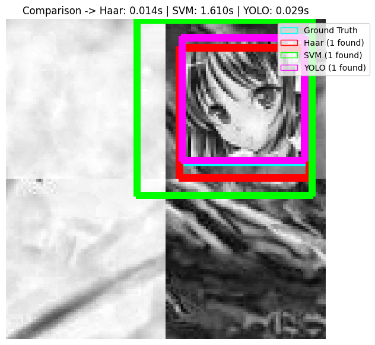
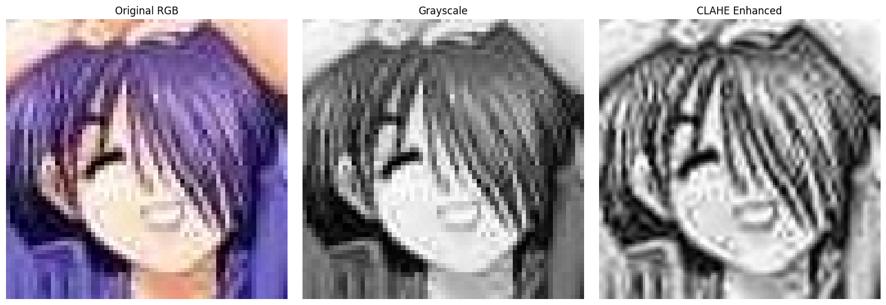

# Anime Face Detection: A Comparative Study (Haar Cascades vs. HOG+SVM vs. YOLO)

<p align="center">
  
</p>

[](https://colab.research.google.com/drive/11f3IjuP-nFukuSCkKua-bfQQ5a1CktuU?usp=sharing)
[](https://opensource.org/licenses/MIT)

## Abstract
This repository provides a fully reproducible comparative analysis of object detection methodologies applied to highly stylized anime faces. We systematically evaluate the accuracy and computational efficiency of traditional machine learning pipelines (Haar Cascades and HOG+SVM) against a modern single-pass deep learning architecture (YOLO11 Small). Empirical benchmarks demonstrate that YOLO fundamentally resolves the spatial rigidity and latency bottlenecks of sliding-window approaches, achieving 100% recall at real-time processing speeds.

## Methodology: Image Preprocessing
To handle the "flat" shading typical of anime artwork, we applied Contrast Limited Adaptive Histogram Equalization (CLAHE) to amplify local gradients before passing the data to our HOG feature extractor.

<p align="center">
  
</p>

## Directory Structure
* `notebooks/`: Contains the primary interactive computational pipeline.
* `docs/`: Contains the accompanying formal technical report.
* `data/`: Local directory for dynamically downloaded Kaggle and Hugging Face datasets.

## Installation

1. Clone the repository:
   ```bash
   git clone https://github.com/h-nam-edu/anime-face-detection-comparison.git
   cd anime-face-detection-comparison


2.  Install the required dependencies:
    ```bash
    pip install -r requirements.txt
    ```
    *Note: A CUDA-enabled GPU is highly recommended for the YOLO training phases.*

## Usage

The entirety of the data acquisition, preprocessing, training, and benchmarking pipeline is contained within the interactive notebook.

To run the pipeline:

1.  Navigate to the `notebooks/` directory.
2.  Open `01_comparative_study.ipynb` in Jupyter or Google Colab.
3.  Execute the cells sequentially. Datasets and baseline XML cascades will download automatically via API.

## Qualitative Comparison

While the Haar Cascade generalized well spatially, the dense-scanning SVM struggled with precision on complex backgrounds. Below is a synthetic test showing Ground Truth, Haar Cascade (Red), and SVM (Green) predictions.

<p align="center"\>

</p\>

## Final Benchmark Results

| Method | Recall (Accuracy) | FPS (Speed) | Avg IoU (Precision) | False Positives |
| :--- | :--- | :--- | :--- | :--- |
| **Haar Cascade** | 93.77% | 114.19 | 0.77 | 0 |
| **Optimized HOG+SVM** | 72.34% | 1.19 | 0.78 | 76 |
| **YOLO11 Small** | **100.00%** | 72.46 | **0.94** | **0** |

## Citation

If you utilize this pipeline or the synthetic datasets generated within this study for your own research, please cite this project:

```bibtex
@article{nguyen2026animeface,
  title={Anime Face Detection: A Comparative Study (Haar Cascades vs. HOG+SVM vs. YOLO)},
  author={Nguyen, Hai Nam},
  journal={FPT University},
  year={2026}
}
```
